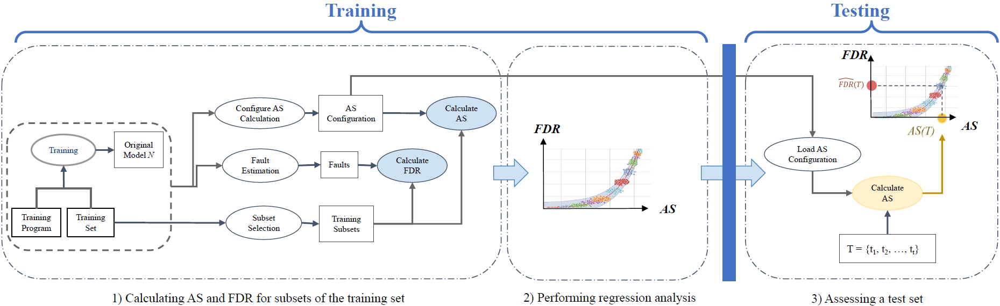

## Replication Package for ["TEASMA: A Practical Methodology for Test Adequacy Assessment of Deep Neural Networks"](https://ieeexplore.ieee.org/document/10720834)


## Introduction

Welcome to the replication package for "TEASMA: A Practical Methodology for Test Adequacy Assessment of Deep Neural Networks." This repository provides all necessary code and detailed instructions required to replicate the experimental results discussed in the paper. TEASMA introduces a robust methodology that leverages state-of-the-art test adequacy metrics—MS, DSC, LSC, and IDC—to assess test sets prior to the validation and deployment of deep neural networks (DNNs). The study primarily focuses on comparing the accuracy of the Fault Detection Rate (FDR) prediction across these metrics to identify the most effective one.


# Code Overview

This repository includes Python 3.8 code that implements the experiments and analyses described in the paper.

## Quick Replication Guide <a name="Quick-Replication"></a>

Follow these steps to reproduce the experiment's results of RQ1, RQ2, and RQ3:


### Setting Up the Environment

1. Download the `TEASMA.zip` file from this repository.
2. Extract the contents of the downloaded zip file to your local machine.
3. Navigate to the root directory of the extracted package:

    ```bash
    cd {path_to_root_directory}/output_results
    ```
#### Installation Requirements

Install the required packages using the `requirements.txt` file.
```bash
pip install -r requirements.txt
```

Execute the following commands to regenerate the results for all metrics:

```bash
python plots_MS/correlation_build_model_MS_FDR.py
python plots_SC/correlation_build_model_SC_FDR.py
python plots_IDC/correlation_build_model_IDC_FDR.py
```

These scripts will use the specified metrics and Fault Detection Rates (FDRs) obtained from running the full replication process detailed in the section Replication from Scratch. Outputs, including regression results, correlations between the metrics and FDR, and all figures from the paper, will be stored in the correlation_outputs folder within the respective plots_{metric} directory.


In the subsection [Replication from Scratch](#Replication-from-Scratch) we provide all the scripts and data required to perform the full replication.


## Replication from Scratch <a name="Replication-from-Scratch"></a>

### Directory Structure
Due to the large size of some files in the project, we have divided them into smaller sizes and uploaded them separately. We have outlined where these large directories and files need to be integrated. For clarity, please refer to the tree diagram below. Download the files and directories that are not included in the TEASMA project and place them in the specified locations within this diagram:

```

TEASMA/
│
├── IDC_code/              # All source codes for IDC
|   └──── data_subsets     # Download the **data_subsets.xz** and after extraction copy its contents here. 
|         └──── cifar10
|         └──── cifar100
|         └──── fashion_mnist
|         └──── imagenet
|         └──── mnist
|         └──── SVHN
|
|
├── SC_code/               # All source codes for SC (DSC and LSC)
|   |
|   └──── ATS_predicteds            # Download ATS_predicteds.zip from **SC_code_dependencies/ATS_predicteds.zip** and extract here
|   └──── models                    # Download **models.zip** and extract here
|   └──── SA_results                # Download SA_results.zip from **SC_code_dependencies/ATS_predicteds.zip** and extract here
|   └──── data                      # Download the **data_subsets.xz** and after extraction copy its contents in to **data** directory. 
|         └──── cifar10
|         └──── cifar100
|         └──── fashion_mnist
|         └──── imagenet
|         └──── mnist
|         └──── SVHN
|
|
├── MS_code/               # All source codes for MS
|   |
|   └──── data             # Download the **data_subsets.xz** and after extraction copy its contents in to **data** directory.  
|   |     └──── cifar10
|   |     └──── cifar100
|   |     └──── fashion_mnist
|   |     └──── imagenet
|   |     └──── mnist
|   |     └──── SVHN
|   |   
|   └──── fault_extraction
|   |     └──── output                                # Download output.zip from **MS_code__dependencies/fault_extraction/outpout.zip** and extract here
|   |     
|   └──── mutants                                     # Download output.zip from **MS_code__dependencies/mutants.zip** and extract here 
|   |     └──── mutant_prediction_outputs             # Download **mutant_prediction_outputs.zip** from following links [mutant_prediction_outputs.zip]
|   |     └──── vgg16_SVHN                            # Download **vgg16_SVHN.tar.gz** from following links [vgg16_SVHN.tar.gz]
|   |     └──── resnet152_cifar100                    # Download **resnet152_cifar100.zip** from following links [resnet152_cifar100.zip]
|   |     └──── inceptionV3_imagenet                  # Download **inceptionV3_imagenet.zip** from following links [inceptionV3_imagenet.zip]
|   |
|   └──── models                                     # Download **models.zip** and extract here
|
|
│
├── output_results/               # Essential for Quick Replication 
│
└── README.md
└── TEASMA_workflow.png
└── tree.txt


```
* ### Links to download the some files mentioned above 

    - [mutant_prediction_outputs.zip](https://uottawa-my.sharepoint.com/personal/aabba038_uottawa_ca/Documents/TEASMA_5th_July_2024_requirements?csf=1&web=1&e=yxs26a)
    - [vgg16_SVHN.tar.gz](https://uottawa-my.sharepoint.com/personal/aabba038_uottawa_ca/Documents/TEASMA_5th_July_2024_requirements?csf=1&web=1&e=yxs26a)
    - [resnet152_cifar100.zip](https://uottawa-my.sharepoint.com/personal/aabba038_uottawa_ca/Documents/TEASMA_5th_July_2024_requirements?csf=1&web=1&e=yxs26a)
    - [inceptionV3_imagenet.zip](https://uottawa-my.sharepoint.com/personal/aabba038_uottawa_ca/Documents/TEASMA_5th_July_2024_requirements?csf=1&web=1&e=yxs26a)


For a comprehensive replication using each adequacy metric from scratch, navigate to each related code directory:

* ### MS_code
* ### SC_code
* ### IDC_code

Running the full replication package requires more dependencies. Install the `rquiriments.txt` in each `{AS}_code` directory using the following command:

```bash
 pip install -r requirements.txt
```


## References
- [DeepMutation++](https://sites.google.com/view/deepmutationpp/home)
- [Input Distribution Coverage: Measuring Feature Interaction Adequacy in Neural Network Testing](https://github.com/less-lab-uva/InputDistributionCoverage/tree/main)
- [Evaluating Surprise Adequacy for Deep Learning System Testing](https://github.com/coinse/sadl)
- [DNN-TIP: Common Test Input Prioritizers Library](https://github.com/testingautomated-usi/dnn-tip)
- [Black-Box Testing of Deep Neural Networks through Test Case Diversity](https://github.com/zohreh-aaa/DNN-Testing/tree/main) 


